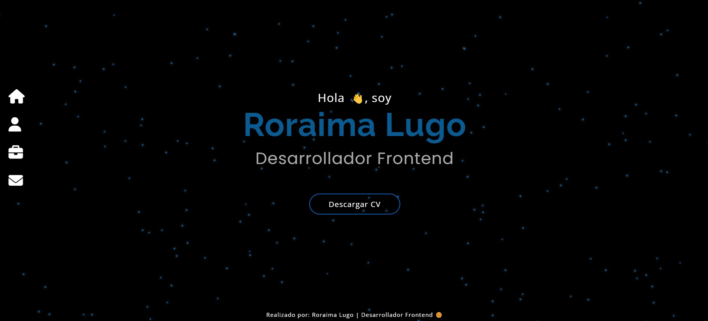

# Portafolio

Este proyecto fue generado con [Angular CLI](https://github.com/angular/angular-cli) version 16.2.0.

## Desarrollo

1. Clonar el proyecto
2. Ejecutar ```npm install```
3. Ejecutar la app ```npm start``` o bien ```ng serve -o```

## Vista Previa



